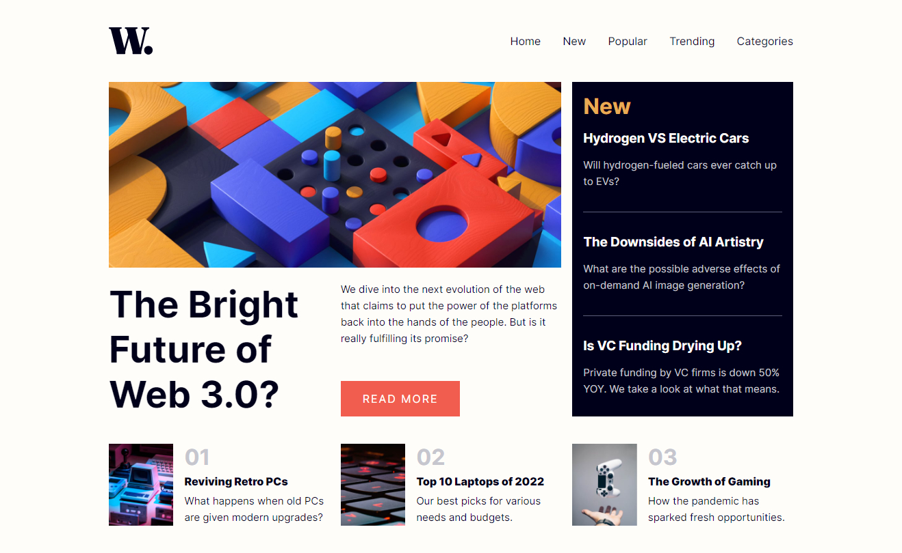

# Frontend Mentor - News homepage solution

This is a solution to the [News homepage challenge on Frontend Mentor](https://www.frontendmentor.io/challenges/news-homepage-H6SWTa1MFl). Frontend Mentor challenges help you improve your coding skills by building realistic projects. 

## Table of contents

- [Overview](#overview)
  - [The challenge](#the-challenge)
  - [Screenshot](#screenshot)
  - [Links](#links)
- [My process](#my-process)
  - [Built with](#built-with)
- [Author](#author)

## Overview

The News Homepage challenge from Frontend Mentor provides front-end developers with an opportunity to practice their coding skills. The goal is to build a news website homepage that closely resembles the provided design.

### The challenge

Users should be able to:

- View the optimal layout for the interface depending on their device's screen size
- See hover and focus states for all interactive elements on the page

### Screenshot

### Links

- Solution URL: [https://github.com/lucasbsand/news-homepage/](https://github.com/lucasbsand/news-homepage/)
- Live Site URL: [Add live site URL here](https://your-live-site-url.com)

## My process

I started my project by structuring the HTML. So I created a file to write my CSS and then I added the font I would use and saved the project’s color palette in variables. Finally, I created my JS file and implemented a function that toggle the menu.

### Built with

- Semantic HTML5 markup
- CSS custom properties
- Flexbox
- CSS Grid

## Author

- Frontend Mentor - [@lucasbsand](https://www.frontendmentor.io/profile/lucasbsand)
